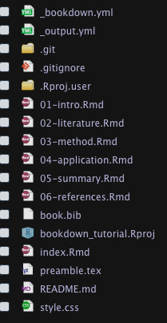
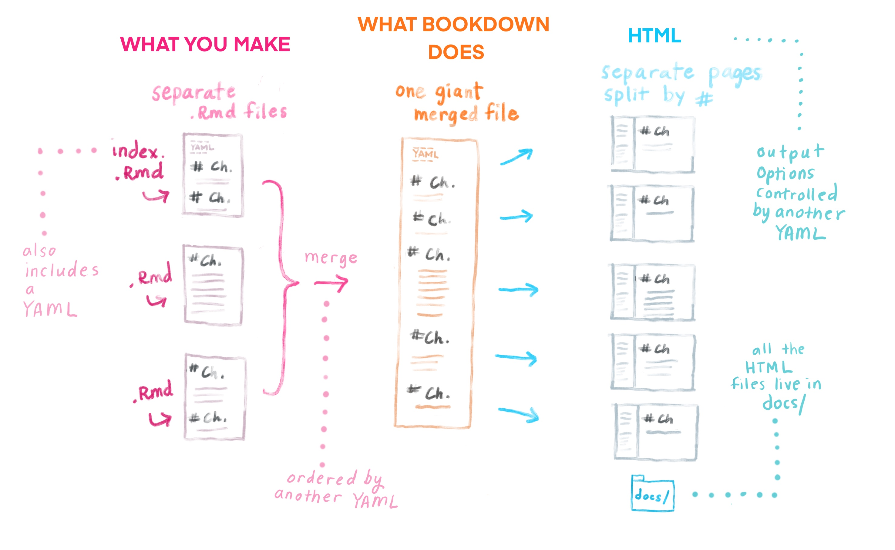

# Get Started

## 初始化bookdown專案

-   開始一個bookdown專案很簡單，先在Rstudio開啟一個新專案，選bookdown\

-   開起來後，這個專案資料夾中，就會長成下圖：\
    

-   可以看到，這個資料夾下的結構，包括幾大塊：

    -   3 個 YAML檔： \_bookdown.yml, \_output.yml, index.Rmd\
    -   6 個範例.rmd檔: 01-Intro.Rmd, ..., 06-reference.Rmd\
    -   git檔： .git資料夾和.gitignore\
    -   其他optional可以刪掉的檔：book.bib, preamble.tex, style.css這些\

-   這邊先介紹三個重要的YAML檔：

    -   \_bookdown.yml: 裡面可以設定章節順序、build出的html/pdf等要output到哪個資料夾\
    -   \_output.yml: 裡面可以設定你要output的格式(e.g. html電子書, pdf, ePub...)，sidebar的toc想長成怎樣(e.g. header, footer, 或是collapse sub-section)，電子書上提供作者github連結、download連結\
    -   index.Rmd: 這會是網頁電子書的homepage，或是pdf書籍的preface。

## 更新_bookdown.yml中的內容：

-   打開原本的`_bookdown.yml`，並幫他新增兩行指令，變成下面這樣：

<!-- -->

    book_filename: "bookdown_tutorial"
    delete_merged_file: true
    language:
      ui:
        chapter_name: "Chapter "
    output_dir: docs   
    new_session: true

-   一個一個解釋：

    -   `book_filename: "bookdown_tutorial"`，這很明顯就是書籍的名稱\
    -   `delete_merged_file: true`： build book時，他會把k個.Rmd檔，先compile成k個.html檔，然後再merge成一個大的.html檔。那這邊設定true，就是只要留merge好的檔就好，原本那k個html檔請幫我刪掉\
    -   `chapter_name: "Chapter "`：這會幫你把每個章節的前面，都加上`Chapter`的字樣\
    -   `output_dir: docs`，這是新加入的指令，要求把build出來的html檔，都放到`./docs`的資料夾中。會做這樣的設定，是因為之後如果要把這本書，發佈到github pages(或是Netlify)，他們都是去`./docs`裡面找html檔。\
    -   `new_session: true`：這也是新加入的指令，他的意思是，我會獨立的對每個.Rmd檔做complie，並生出各自的html檔。如果沒做這個設定，那他會先把所有.Rmd檔都merge成一個超大.Rmd檔，然後compile這個超大的.Rmd檔，變成1個html檔。那這樣就很容易因為不同的.Rmd檔裡面用到相同名稱的變數，而造成彼此衝突。

## 調整_output.yml的內容

-   打開`_output.yml`這個檔案，原本長這樣：

<!-- -->

    bookdown::gitbook:
      css: style.css
      config:
        toc:
          before: |
            <li><a href="./">A Minimal Book Example</a></li>
          after: |
            <li><a href="https://github.com/rstudio/bookdown" target="blank">Published with bookdown</a></li>
        download: ["pdf", "epub"]
    bookdown::pdf_book:
      includes:
        in_header: preamble.tex
      latex_engine: xelatex
      citation_package: natbib
      keep_tex: yes
    bookdown::epub_book: default

-   從架構上，就可以看到，他要output成三種格式：

    -   gitbook\
    -   pdf_book\
    -   epub_book\

-   那因為，我只有興趣gitbook格式(就是html網頁拉)，所以我會先把pdf_book和epub_book都刪掉\

-   接著講解`bookdown::gitbook`下的設定：

    -   `css: style.css`:\
    -   `config`下，他設定了`toc`和`download`這兩塊。`toc`是網頁左側的outline，他加上`before`和`after`，意思是想把toc排列成 `before message -> chapter names -> after message` 這樣。我們現在從簡，所以刪光before和after。另外，`download`，是要做出download的按鈕，讓user可以把html下載成pdf或epub。\

-   最終，我們只保留`gitbook`的part，並刪除css, 刪除config下的toc，改動download的內容，變成：

```{=html}
<!-- -->
```
        bookdown::gitbook:
          config:
            download: ["pdf", "epub"]

## 調整index.Rmd

-   記得，`index.Rmd`是唯一可以在最上面寫YAML指令的檔案，其他.Rmd檔都不行

## 調整/新增自己的.Rmd檔案

-   現在可以把根目錄下的.Rmd檔全刪了，這都不是我要的\
-   我可以開一個新的.Rmd檔，最上面不能有YAML設定，而是以 `# Level 1 Header`當開頭\
-   這個Header就會是到時候顯示出來的章節名稱  

## 關閉Jekyll

-   之後我們如果想發佈在GitHub pages，那需要先關閉Jekyll。因為GitHub Pages預設會使用Jekull來建立你的statis site，但，R Markdown相關的網頁，不需要用Jekyll。
-   要做到這件事，就是在專案根目錄下，建立一個`.nojekyll`的空資料夾即可

## Build a book

### 不要按`Knit`

-   不要按 `Knit`來compile各個.Rmd檔，如果不小心按了，那再自己把`_book`這個資料夾清掉

### 按Preview Book來build gitbook

-   如果你想要render出網頁電子書格式(gitbook)，那就在Addins的下拉式選單中，選取`Preview Book`，就會完成compile ():

    -   把index.Rmd執行一次，得到index.html，放到`./docs`之中，這會是首頁\
    -   把所有.Rmd檔都執行一次，得到一堆.html檔，都放到`./docs`之中\
    -   按章節順序組出來\

-   上面的做法，等同於在console中key入：`bookdown::serve_book()`，或是，`bookdown::render_book("index.Rmd")`
-   他在背後做的事，可整理成下圖：  




### key 入 `preview_chapter("my-chapter.Rmd")`

-   那這樣做，就像以前在RMarkdown中，對`my-chapter.Rmd`點`Knit`。但記得，在bookdown的世界，不要再點`Knit`了，所以才這樣做。\
-   這樣做的好處是，不用compile所有.Rmd檔，只要compile你指定的`my-chapter.Rmd`就好

### 一次build好幾種格式的book

-   如果你想同時build: gitbook(i.e. 網頁電子書)、pdf_book、epub_book，那你可以按`Build`頁籤下的`Build Book`，他就會一次幫你build完
-   如果你在`_output.yml`中，只有設定`bookdown::gitbook:`，那其實你用這邊的`Build Book`，或是剛剛講的`Preview Book`，其實是完全一樣的  

## push到github  

* 在github先開個專案，名稱取的和現在這個專案一樣，記得不要勾README  
* 接著就push上去吧！  

```
git remote add origin git@github.com:LeeHank/bookdown_tutorial.git
git push -u origin master
```

* 接著進到github的這個專案，選上方的`Settings`，再從左邊的分類中找到`Pages`。  
* 在source的地方，選`Branch:master`，以及`/docs`，按下save，就搞定了  
* 他會顯示，我們的網頁被publish在 https://leehank.github.io/bookdown_tutorial/  
* 所以這串網址很規律：`https://{username}.github.in/{repository}`  

