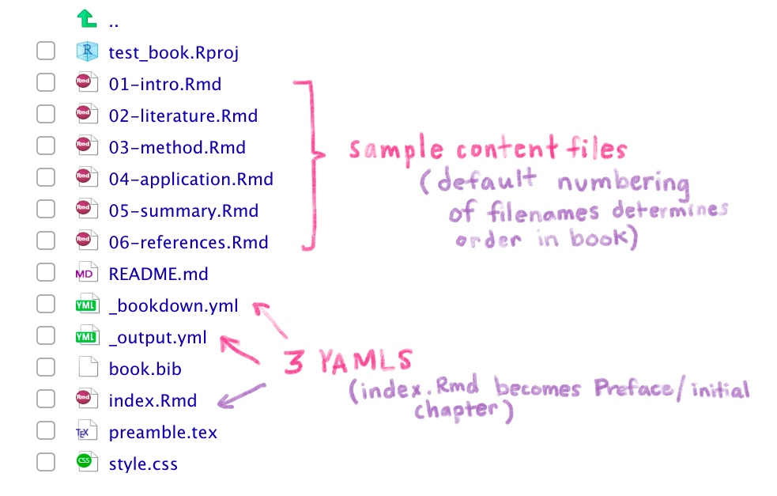
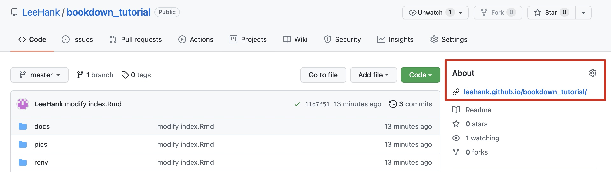

--- 
title: "Bookdown Tutorial"
author: "Hank Lee"
date: "2021-12-11"
site: bookdown::bookdown_site
description: "This is a minimal example of using the bookdown package to write a book. The output format for this example is bookdown::gitbook."
github-repo: LeeHank/bookdown_tutorial
---

# Overview {-}  

## Intro  

* bookdown 的簡短 tutorial  
* 主要是參考這本書第五章進而實作：[rstudio4edu](https://rstudio4edu.github.io/rstudio4edu-book/make-book.html)
官方文件在這：[bookdown](https://bookdown.org/yihui/bookdown/)  

## Cheatsheet  

* 以下，列出整個 workflow 的執行步驟(詳細說明請看第一章)  

### 建立 R Project (renv+git+bookdown)  

* 如果是全新 project，就跟之前一樣，建立一個 renv+git的專案  
* 在 r console 中，輸入 `bookdown:::bookdown_skeleton(getwd())`，就會幫你新增好 bookdown 必要的檔案和資料夾模板，例如下圖： 
  
* 把專案整個關閉，再重開，RStudio就會讀到這是個 bookdwon 專案，幫你把右上角的 pannel 裡面，多加上一個 `Build` 的 tab 可以使用  

### 修改三個 YAML 檔  

#### 修改 `_bookdown.yml` 內容  

* 打開這個檔案，改成以下這個模板：

```
book_filename: "bookdown_tutorial" # 書名
output_dir: docs # 將 markdown 轉成 html後，寫到這個資料夾
delete_merged_file: true # 
language:
  ui:
    chapter_name: "Chapter "
new_session: true # 獨立的對每個.Rmd檔做complie，並生出各自的html檔，各rmd的變數不打架
# 章節排列方式
rmd_files: 
- index.Rmd
- 01-get_started.Rmd
- 02-detail.Rmd
```
* 這邊特別要提醒的是，第二行是指定output的資料夾叫做docs。這是因為到時候 publish 到 github pages 的時候，他是認 `docs` 這個資料夾，拿裡面的 html 當網頁內容    

#### 修改 `_output.yml` 內容  

* 打開這個檔案，改成以下這個模板  

```
bookdown::gitbook:
  config:
    toc:
      collapse: section
    download: ["rmd"]
    sharing:
      github: yes
      facebook: no
      twitter: no
      all: no
```

#### 修改 index.Rmd 最上面的 YAML  

* 打開這個檔案，把最上面的 YAML 改成  

```
--- 
title: "Bookdown Tutorial"
author: "Hank Lee"
date: "2021-12-11"
site: bookdown::bookdown_site
description: "This is a minimal example of using the bookdown package to write a book. The output format for this example is bookdown::gitbook."
github-repo: LeeHank/bookdown_tutorial
---
```

### 新增 `.nojekyll` 檔案  

* 在根目錄，新增 `.nojekyll` 這個檔案  
* 原因是，到時候用 github pages來serve我們的網站時，預設會用 `jekyll`來把資料夾內的所有 markdown file 給轉成 website。但是，我們用 bookdown時，他已經幫我們翻譯好 index.html 以及各章節對應的 html，所以 `docs` 這個資料夾已經是完整的 standalone website 了。那我寫 `.nojekyll` 這個檔案，就是告訴 github 不要再雞婆幫我用 `jekyll` 轉一次了， I'm good!  

### Compile book  

#### 用 `build` compile 整本書  

* 按下右上角 `build` panel 裡面的 `Build Book` 來 compile 整本書 (背後的流程，是把所有 RMarkdown 的檔案整併成一個 giant rmarkdown file，然後by chapter翻譯成一份一份的 html 檔，丟到 `docs` 資料夾裡面)  

#### 用 `preview` compile 指定的 .Rmd file  

* 如果是在撰寫過程中，只想看看正在寫的這份 rmarkdown file的結果，那就按 `Addins` 裡面的 `Preview Book`  

### Commit & Push  

* commit 後 push 到 github 上  

### 到 Github 網頁做設定  

* 在github先開個專案，名稱取的和現在這個專案一樣，記得不要勾README  
* 接著就push上去吧！  

```
git remote add origin git@github.com:LeeHank/bookdown_tutorial.git
git push -u origin master
```

* 接著進到github的這個專案，選上方的`Settings`，再從左邊的分類中找到`Pages`。  
* 在source的地方，選`Branch:master`，以及`/docs`，按下save，就搞定了  
* 他會顯示，我們的網頁被publish在 https://leehank.github.io/bookdown_tutorial/  
* 所以這串網址很規律：`https://{username}.github.in/{repository}`  
* 到 github 的資料夾頁面，右上角的 `About` 有個齒輪，把剛剛的 website 網址加入進去，那之後瀏覽code的時候，就可以看到網址的提示  
  
